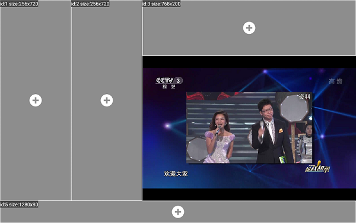
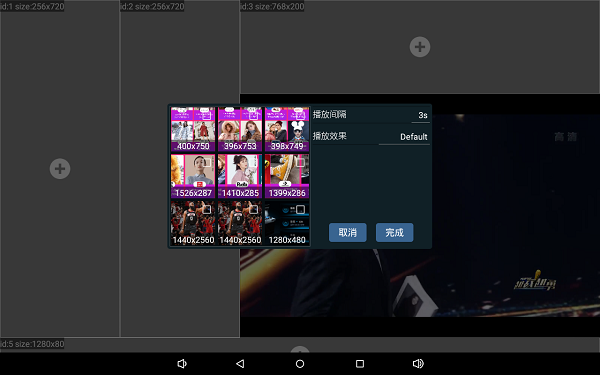
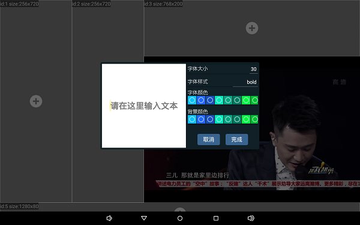
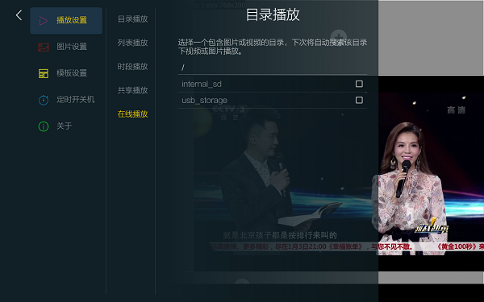
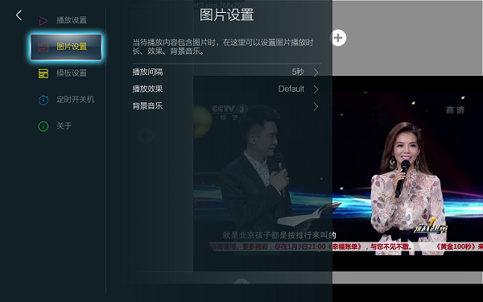
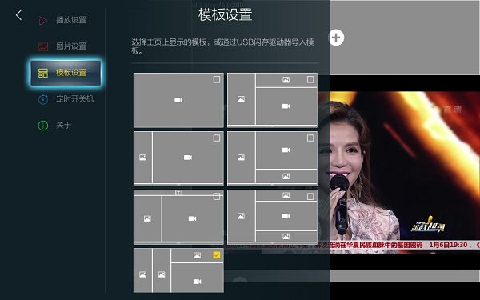
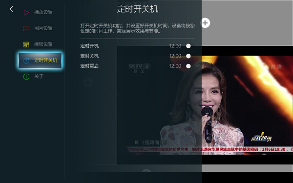

## 预览








## 设置
### 播放设置
- 目录播放 -- 选择一个目录，自动播放该目录下视频与图片
- 列表播放 -- 制作播放列表，播放器按列表顺序播放视频与图片 
- 时段播放 -- 定时播放制作好的播放列表
- 共享播放 -- 播放PC共享目录下的视频与图片
- 在线播放 -- 播放在线url流媒体

### 图片设置
- 播放间隔
- 播放效果
- 背景音乐

### 模板设置
选择首页展示样式

### 定时开关机
- 定时开机
- 定时关机
- 定时重启

#### 关于
- 产品型号
- 应用版本号
- 系统版本号
- Android版本号
- 厂商

## 在线升级
APP需支持支持OTA升级

## 遥控器快捷功能
当用户U盘中，有设定好了几个文件夹，文件夹中会放不同的视频和图片内容，如：  
U盘内有5个文件夹，分别命名为：folder1、folder2、folder3、folder4、folder5，当用户操作遥控器或者键盘或者对应的按键，1键则顺序播放folder1的内容后，如果U盘根目录没有视频和图片，则循环播放folder1中的内容，依此类推。

## U盘配置文件
命名为：config.ini，放置在U盘根目录
```
#删除内置文件配置，1：删除全部内置文件 | 0：不删除
DEL=1

#复制U盘文件配置，1：复制U盘中媒体文件到内置目录 | 0：不复制
COPY=1

#在线播放列表配置，属性名为："URL_x"，"x"为整数从1~100，中间需要连续，比如不能：URL_1, URL_3，应该：URL_1, URL_2, URL_3...
URL_1=http://ivi.bupt.edu.cn/hls/cctv1hd.m3u8
URL_2=http://ivi.bupt.edu.cn/hls/cctv3hd.m3u8
URL_3=http://ivi.bupt.edu.cn/hls/cctv5hd.m3u8
URL_4=http://ivi.bupt.edu.cn/hls/cctv5phd.m3u8
URL_4=http://ivi.bupt.edu.cn/hls/cctv6hd.m3u8

#文本广告配置，属性名为："TEXT_x"，"x"为模板中文本广告id
TEXT_4=这里是文本广告
```

## U盘模板配置文件
命名为：template.ini，放置在U盘根目录。

首页模板中的元素我们统一称之为“Box”，目前支持三种类型的Box:
- 图片Box
- 文本Box
- 视频Box

```
{
  "id": 1,              //模板id
  "items": [
    {
      "id": 1,          // Box id，必须唯一
      "box_type": 0,    // Box 类型，0：图片Box 1：文本Box 2：视频Box
      "pos_x": 0,       // Box X坐标，相对于屏幕的比例，比如：0.5表示在屏幕中间，1表示在屏幕最右边
      "pos_y": 0,       // Box Y坐标，相对于屏幕的比例，比如：0.5表示在屏幕中间，1表示在屏幕最下方
      "width": 0.2,     // Box 宽度，相对于屏幕的比例，比如：0.5表示的屏幕一半，1表示全屏
      "height": 0.9,    // Box 高度，相对于屏幕的比例，比如：0.5表示的屏幕一半，1表示全屏
      "data": {         // Box 的数据字段，可以不配置数据，将显示一个空Box，可以到界面上再设置数据
        "images": [     // 图片Box对应的图片文件路径，可以增加多个
            "/sdcarc/DCIM/001.jpg",
            "/sdcarc/DCIM/002.jpg"
        ],
        "interval": 3000,   // 图片播放间隔
        "effect": "Default" // 图片播放效果
      }
    },
    {
      "id": 2,
      "box_type": 2,        // 视频Box
      "pos_x": 0.4,
      "pos_y": 0.25,
      "width": 0.7,
      "height": 0.65,
      "data": {             // 不想设置数据可以这样
      }
    },
    {
      "id": 3,
      "box_type": 1,        // 文本Box
      "pos_x": 0,
      "pos_y": 0.9,
      "width": 1,
      "height": 0.1,
      "data": {
        "size": 30,         // 字体大小
        "style": "bold",    // 字体样式
        "text_color": 4294967295,   // 字体颜色（整形颜色值）
        "bg_color": 0,      // 背景颜色（整形颜色值）
        "text": ""          // 文本
      }
    }
  ]
}
```
